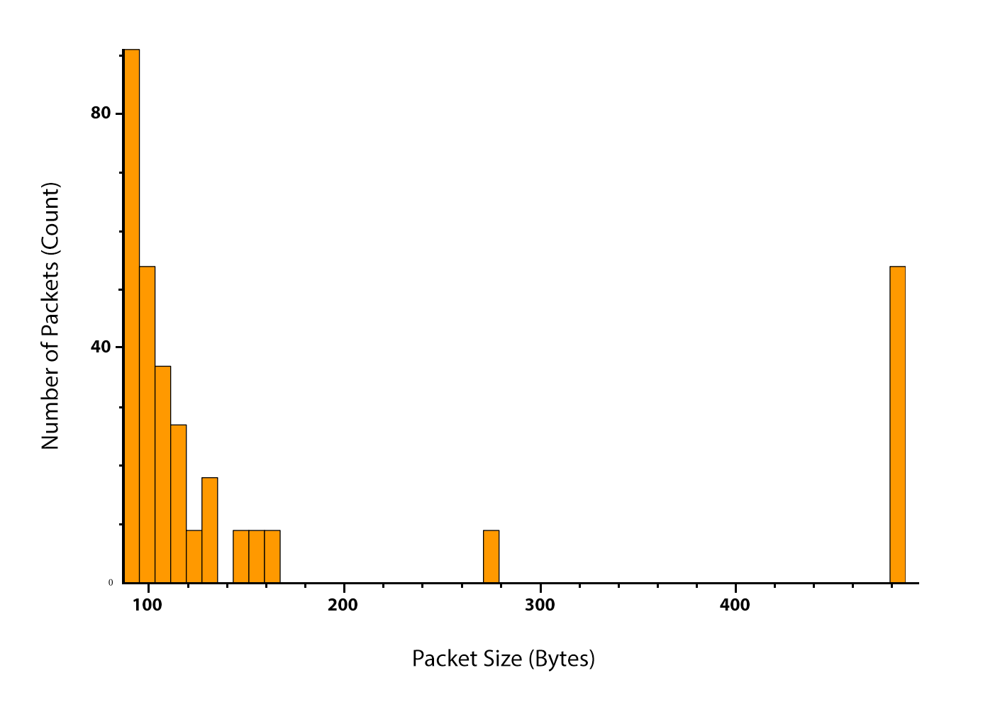

# go-packet-peeker
**Analyze packet size variations to identify potential covert payloads.**

## Overview

`go-packet-peeker` is a command-line tool written in Go for analyzing network packet captures (PCAP or PCAPNG). 
It helps with identifying anomalies in packet sizes that might indicate covert data exfiltration or other non-standard activities.

For many network protocols, especially specific control messages (like ICMP Type 03 "Destination Unreachable"), 
packet sizes are expected to be relatively consistent. Significant variations in the size of these packets within a 
specific communication flow could suggest that they are being used to carry unauthorized payloads.

This tool allows you to:
1.  Get an overview of a packet capture.
2.  Drill down into a specific communication flow between a specific source and destination IP pair.
3.  Analyze the types of protocols used in that flow.
4.  Visualize the distribution of packet sizes for a chosen protocol within that flow using a histogram.
5.  If anomalies are suspected, extract and inspect the ASCII payloads of packets within a specified size range for that specific flow and protocol.

## How It Works

The tool operates in an interactive, step-by-step manner:

1.  **Initial Scan:** Reads the entire PCAP file to identify all unique IP addresses and count total packets.
2.  **IP Flow Selection:** Prompts the user to select a source IP and then a destination IP from the lists discovered in the initial scan.
3.  **Protocol Breakdown:** Analyzes traffic specifically between the selected source and destination IPs and shows a count of each protocol type observed in this flow.
4.  **Protocol Selection:** Prompts the user to select a specific protocol from this breakdown for further analysis.
5.  **Histogram Generation:** For the selected IP flow and protocol, it analyzes packet sizes and generates a histogram (`result.png`) showing the frequency of different packet sizes.
6.  **Payload Analysis Setup:** Prompts the user to enter a minimum and maximum packet size range.
7.  **Payload Extraction:** Filters packets matching all criteria (Source IP, Destination IP, Protocol, and Size Range) 
8. and writes their payloads (as printable ASCII, with non-printable characters replaced by '.') to `cleaned_unique_payloads.csv`.

## Prerequisites

* **Go:** Version 1.18 or higher (for generics, though the current code might work with slightly older versions if generics are not yet used heavily; it's good practice to use a recent Go version).
* **libpcap:** (or its equivalents like Npcap on Windows, libpcap-dev on Debian/Ubuntu, libpcap-devel on Fedora/CentOS). This is required by the underlying `gopacket/pcap` library for capturing and reading pcap files.

## Installation / Building

1.  Clone the repository (or download the `main.go` file).
    ```bash
    # git clone https://github.com/faanross/go-packet-peeker
    # cd go-packet-peeker
    ```
2.  Ensure Go is installed and your `GOPATH` is set up.
3.  Fetch dependencies:
    ```bash
    go get github.com/google/gopacket
    go get gonum.org/v1/plot
    ```
4.  Build the application:
    ```bash
    go build -o go-packet-peeker ./cmd/main.go
    ```
    This will create an executable named `go-packet-peeker` (or `go-packet-peeker.exe` on Windows).

## Usage

Run the compiled application from your terminal, providing the path to a PCAP or PCAPNG file using the `-f` flag:

```bash
./go-packet-peeker -f /path/to/your/capture.pcapng
````

Note that a sample pcapng has been included in `./sample/icmp3.pcapng`


The program will then guide you through the interactive selection process.

## Example Workflow

1. **Run the command:**

   

```Bash
    ./go-packet-peeker -f ./sample/icmp3.pcapng
```

2. **Initial Output:**

```Bash
    Performing initial scan...
    
    --- Initial Analysis Complete ---
    Total packets in file: 42485
    
    All Source IPs found:
      - 143.198.3.13
      - 192.168.2.115
    
    All Destination IPs found:
      - 143.198.3.13
      - 192.168.2.115
  ```

3. **Select IPs:**

```Bash
    --- Select IPs for Flow Analysis ---
    Select Source IP:
      1: 143.198.3.13
      2: 192.168.2.115
    Enter number: 1
    Source IP: 143.198.3.13, Destination IP: 192.168.2.115
  ```

   (Assume you select `192.168.2.115` for destination similarly)

4. **Protocol Breakdown:**

```Bash
    --- Flow Protocol Analysis Complete ---
    Total packets from 143.198.3.13 to 192.168.2.115: 326
    
    Protocol Breakdown:
      - ICMPv4 (Type 03): 326
   ```

5. **Select Protocol:**

```
    --- Select Protocol for Histogram & Payload Analysis ---
    Select Protocol:
      1: ICMPv4 (Type 03)
    Enter number: 1
    Protocol selected: ICMPv4 (Type 03)
```

6. **Histogram Generation:** A file named `result.png` will be created in the current directory, showing the packet size distribution for ICMPv4 (Type 03) packets in this flow.

7. **Enter Size Range for Payload Analysis:**

    ```
    --- Enter Packet Size Range for Payload Analysis ---
    Enter minimum packet size (for ICMPv4 (Type 03) flow): 100
    Enter maximum packet size (for ICMPv4 (Type 03) flow): 500
    Analyzing payloads for packets between 100 and 500 bytes.
    ```

8. **Payload Report:** For packets within the specified range (100 to 500 bytes in this example), it extracts the payload, interprets it as ASCII, cleans non-ASCII characters, and saves a list of unique payloads to a CSV file named `cleaned_unique_payloads`.


## Sample File

A sample capture file can be placed at `./sample/icmp3.pcapng` for testing and demonstration purposes.

## Contributing

Contributions are welcome! Please feel free to open an issue or submit a pull request.

## License

Cartman License - _Whatever, whatever, do you what you want_.

