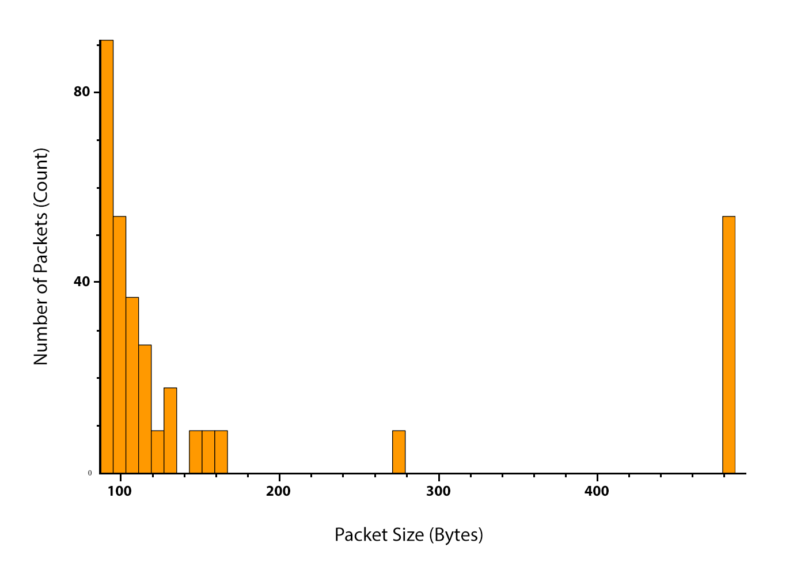

# go-packet-peeker

[](https://golang.org/) [](LICENSE) [](https://github.com/)

> **Analyze packet size variations to identify covert payloads in network traffic.**

## Overview

`go-packet-peeker` is an interactive CLI tool for detecting covert data exfiltration hidden in protocol messages that should have consistent sizes. Many protocols use fixed-size control messages (like ICMP Type 3 "Destination Unreachable"), and significant size variations within a specific communication flow can indicate unauthorized payload smuggling.

### Use Cases

| Scenario | Detection Target |
|----------|-----------------|
| **ICMP Tunneling** | Data hidden in ICMP echo/reply or error messages |
| **Protocol Abuse** | Oversized DNS, NTP, or other control packets |
| **Covert Channels** | Any protocol where packet sizes should be uniform |
| **Data Exfiltration** | Unusual payload sizes indicating smuggled data |

## Features

- **Interactive Flow Selection**: Choose specific source/destination IP pairs to analyze
- **Protocol Breakdown**: See which protocols are used in a communication flow
- **Size Distribution Histogram**: Visualize packet size variations (PNG output)
- **Payload Extraction**: Extract and inspect ASCII payloads within suspicious size ranges
- **Multi-Protocol Support**: IPv4, IPv6, TCP, UDP, ICMP, DNS, HTTP, TLS

## Installation

### Prerequisites

- Go 1.18 or higher
- libpcap development libraries

```bash
# Ubuntu/Debian
sudo apt-get install libpcap-dev

# macOS
brew install libpcap

# Windows: Install Npcap from https://npcap.com
# (Enable "WinPcap API-compatible Mode" during installation)
```

### Build

```bash
git clone https://github.com/faanross/go-packet-peeker.git
cd go-packet-peeker
go mod tidy
go build -o go-packet-peeker ./cmd/main.go
```

## Usage

```bash
./go-packet-peeker -f /path/to/capture.pcapng
```

A sample capture file is included at `./sample/icmp3.pcapng` for testing.

### Interactive Workflow

The tool guides you through analysis step-by-step:

1. **Initial Scan**: Reads PCAP to identify all unique IP addresses
2. **Flow Selection**: Select source and destination IPs
3. **Protocol Breakdown**: View protocol distribution for the selected flow
4. **Protocol Selection**: Choose a specific protocol for deep analysis
5. **Histogram Generation**: Creates `result.png` showing packet size distribution
6. **Size Range Selection**: Specify min/max packet sizes to investigate
7. **Payload Extraction**: Outputs unique payloads to `cleaned_unique_payloads.csv`

### Example Session

```bash
$ ./go-packet-peeker -f ./sample/icmp3.pcapng

Performing initial scan...

--- Initial Analysis Complete ---
Total packets in file: 42485

All Source IPs found:
  - 143.198.3.13
  - 192.168.2.115

--- Select IPs for Flow Analysis ---
Select Source IP:
  1: 143.198.3.13
  2: 192.168.2.115
Enter number: 1

--- Flow Protocol Analysis Complete ---
Total packets from 143.198.3.13 to 192.168.2.115: 326

Protocol Breakdown:
  - ICMPv4 (Type 03): 326

--- Select Protocol for Histogram & Payload Analysis ---
Select Protocol:
  1: ICMPv4 (Type 03)
Enter number: 1

Histogram saved to result.png

--- Enter Packet Size Range for Payload Analysis ---
Enter minimum packet size: 100
Enter maximum packet size: 500
Analyzing payloads for packets between 100 and 500 bytes.

Payload processing complete. 47 unique cleaned payloads written to cleaned_unique_payloads.csv
```

## Output Files

| File | Description |
|------|-------------|
| `result.png` | Histogram showing packet size distribution |
| `cleaned_unique_payloads.csv` | Unique ASCII payloads extracted from suspicious packets |

### Example Histogram



Bimodal or irregular distributions often indicate covert channel activity where some packets carry data while others are legitimate.

## Detection Strategies

### Indicators of Covert Channels

1. **Size Variance in Fixed-Size Protocols**
   - ICMP error messages varying significantly from baseline
   - DNS responses with unusual payload sizes

2. **Bimodal Size Distribution**
   - Clear separation between "normal" and "data-carrying" packets
   - Histogram showing distinct peaks at different sizes

3. **Payload Content Analysis**
   - Base64 or hex-encoded strings in extracted payloads
   - Human-readable text where binary is expected
   - Consistent patterns across "anomalous" packets

### Integration with Threat Hunting

Use the extracted payloads to:
- Search for command strings or encoded data
- Correlate with known C2 signatures
- Identify exfiltration patterns

## Project Structure

```
go-packet-peeker/
├── cmd/
│   └── main.go        # Main application
├── sample/
│   └── icmp3.pcapng   # Sample PCAP for testing
├── img/
│   └── result.png     # Example histogram
├── go.mod
└── README.md
```

## Related Research

- [Malware of the Day: C2 over ICMP (ICMP-GOSH)](https://www.activecountermeasures.com/malware-of-the-day-c2-over-icmp-icmp-gosh/)
- [Understanding C2 Beacons](https://www.activecountermeasures.com/malware-of-the-day-understanding-c2-beacons-part-1-of-2/)

## Legal Disclaimer

This tool is provided for **educational and authorized security testing purposes only**.

- Only analyze traffic from networks you own or have explicit permission to test
- Do not use this tool for unauthorized surveillance
- The author is not responsible for misuse of this software

## Contributing

Contributions welcome! Please open an issue or submit a pull request.

## License

WTFPL - Do What The F*ck You Want To Public License

## Author

**Faan Rossouw** - Security Researcher
- [GitHub](https://github.com/faanross)
- [Active Countermeasures Research](https://www.activecountermeasures.com)
